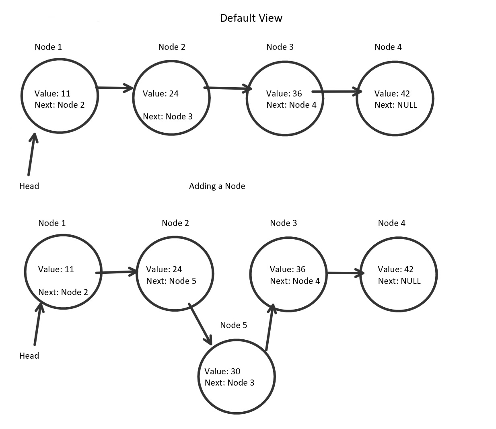

# CHALLENGE: Implement a Linked List 
This program demonstrates a linked list implementation from scratch.

## Data Structure:	
A linked list is a group of objects that are connected to each other 
(hence the term "linked"). The first node is known as the head. 
Starting from the head, each node has its own value and a reference
to the next node. THe last node has a reference to "null" because there
is no next node.

The linked list used in this program hold integers for values, but they can hold
other data types as well.  

## Directions
Implement a Singly linked list. Your LinkList should meet the following criteria:

    O(1) - .Add(Node node) - adds a node to the front of the linked list
    O(n) - .Find(value) - Finds a specific value in the linked list
    O(n) - .Print() - Prints out all of the values in the linked list
    O(n) - .AddBefore(Node newNode, node Node) - Adds a node before an existing node.
    O(n) - .AddAfter(Node newNode, Node existingNode) - Adds a node after an existing node
    O(n) - .AddLast(Node node) - Adds a node to the end of a linked list. 

## Visual

## Linked List Uses
- Linked lists are useful when you don't know how many items will be in a list. Unlike arrays, linked lists can
expand shrink as much as needed. 
- A linked list's traversal term is also fairly predictable, so they are good for
implementations where consistent time is necessary. A Big-O value of O(1) is possible when inserting at the head.

