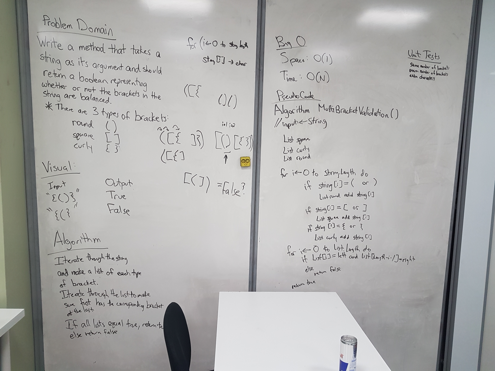

# Whiteboard Challenge 13: Multi-bracket Validation
This program demonstrates some sample strings and returns whether they are "valid."

Example:	
        
    Input 	                    Output
    {} 	                    TRUE
    {}(){} 	                    TRUE
    ()[[Extra Characters]] 	    TRUE
    (){}[[]] 	            TRUE
    {}{Code}[Fellows](()) 	    TRUE
    [({}] 	                    FALSE
    (]( 	                    FALSE

## Challenge
Your function should take a string as its only argument, and should return a boolean representing whether or not the brackets in the string are balanced. There are 3 types of brackets:

    Round Brackets : ()
    Square Brackets : []
    Curly Brackets : {}

## Solution

