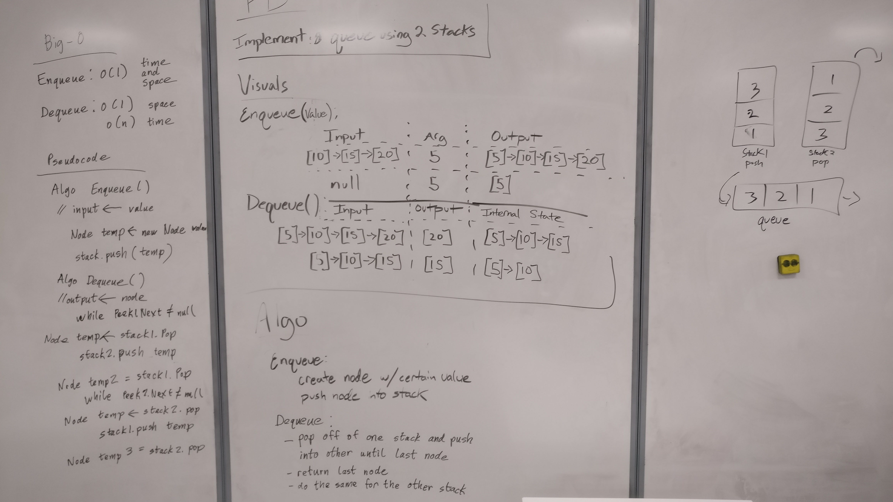

# Whiteboard Challenge 11: Implement a Queue using two Stacks
This program demonstrates a stack emulating queue functionality with custom
"enqueue" and "dequeue" methods.

Example:	
        
    Enqueue
    original stack: TOP --> [10] --> [15] --> [20] --> NULL
    input: 5  
    internal state: TOP --> [5] --> [10] --> [15] --> [20] --> NULL
    output: [5]

    Dequeue
    original stack: TOP --> [10] --> [15] --> [20] --> NULL
    output: [20]

## Challenge
Implement the following methods for the Queue class:

    enqueue(value) which inserts value into the Queue using a first-in, first-out approach.
    dequeue() which extracts a value from the Queue using a first-in, first-out approach.

You have access to 2 Stack instances with push and pop methods.

## Solution
