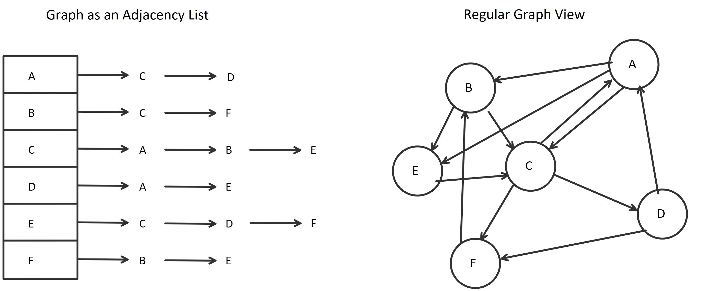

# CHALLENGE: Implement a Graph 
This program demonstrates the implementation of a graph as an adjacency list.

## Data Structure:	
Graphs are a collection of a linked lists or arrays of nodes/vertices. Traversal occurs by
going through a given node's list of children, the children of those children, and so on...

## Directions
Implement your own Graph, as an adjacency list that implements the following:

    AddEdge() - Adds a new vertice to the graph
    GetNodes() - returns all of the nodes in the graph as a collection
    GetNeighbors() - returns a collection of nodes connected to the given node
    Size() - returns the total number of nodes in the graph
    BreadthFirst() - Takes in a root node, and returns a collection of all the nodes visited in order

## Implementation
For this implementation, the graph does not require a root node to be initialized. 
Each node/vertice contains a children, a value, and a visited boolean. 

## Visual

## Graph Uses
- GPS and mapping
- driving directions
- social networks
- airline traffic
- product suggestions on Netflix

