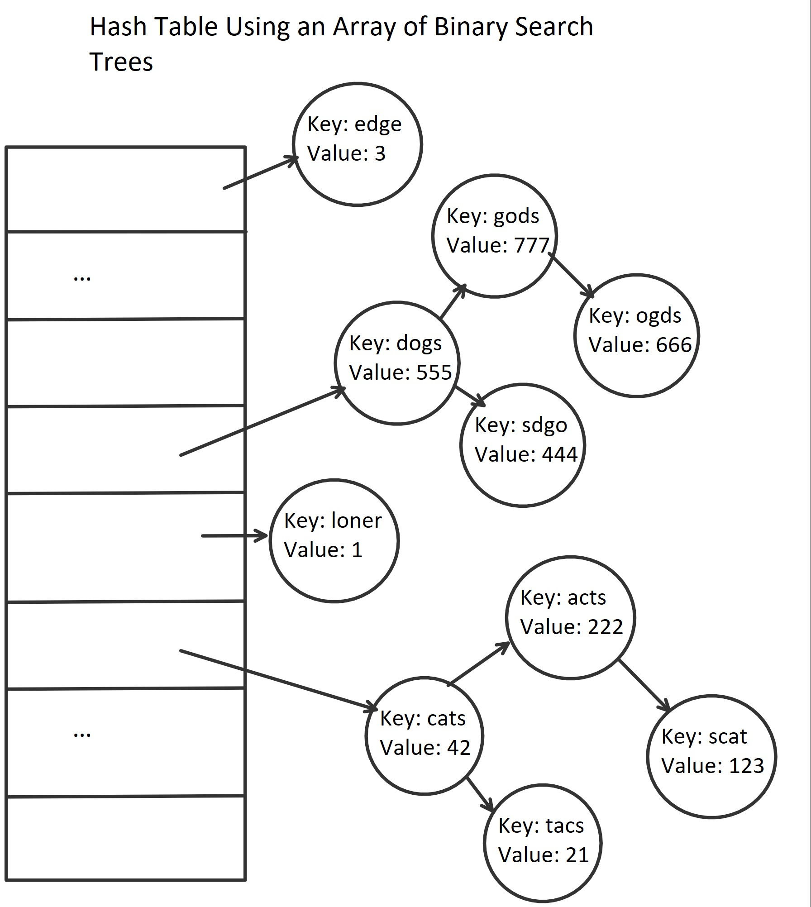

# CHALLENGE: Implement a Hash Table
This program demonstrates a hashtable implementation from using binary search trees.

## Data Structure:	
A hash table is an array containing data structures which can hold a varying amount of objects such as 
a linked list, binary search tree, stack, or queue. A custom algorithm is created to assign a new key value pair 
a hash, which becomes the index within the hash table's array. The node is then placed within the data 
structure chosen (binary search tree in this implementation).

## Directions
Implement a Hashtable with an

    1. Add(key, value) - void return
    2. Find(int key) - returns the value
    3. Contains(int key) - returns bool
    4. GetHash(key)

## Implementation
Within each index of the hash table of an array, a BST can exist. If a new node is added to an index 
without any other objects, a new BST is created. Because find only searches by key, some of the advantages 
of a BST are lost. However, if one wants to search by value, traversal can be shortened.

## Visual

## Hash table uses
Hash tables uses include the following:
- associative arrays
- database indexing
- caches
- sets
- object representation
- unique data representation
- transposition tables