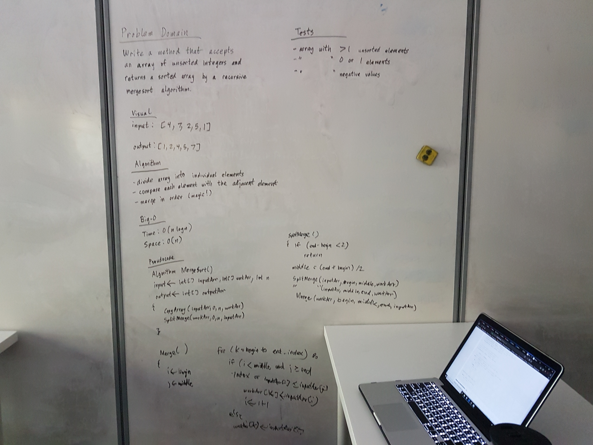

# Implement Mergesort
This program takes an array of integers and returns a sorted array using a
 merge sort algorithm.
```
Example:	        input <-- [3, 2, 4, 1]
			output <-- [1, 2, 3, 4]
```

## Challenge
Write a function that accepts an array of unsorted integers,
 and returns a sorted array by a recursive mergesort 
algorithm.

## Solution

