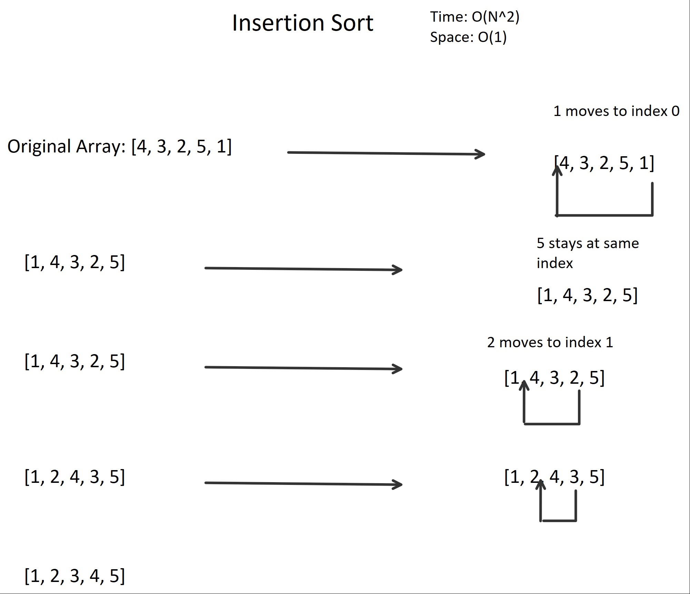

# Implementation: Insertion Sort
This program demonstrates an array of integers and sorts the values in order 
from lowest to highest (left to right).

## Data Structure:	
A sorting algorithm arranges a collection of items in a specific order. This particular collections contains 
an array of integers.

## Directions
Within your Program.cs file, create a method named InsertionSort() that takes in an unsorted array and 
returns a sorted array.

Inside your Main():

    output the unsorted array.
    Send the array through your InsertionSort()
    Output the sorted array

## Implementation
Each node is created as an object of the SinglyLinkedList class containing a node class object 
with an integer value and a reference to the next node (also an object of node class).

## Visual

## Insertion Sort Uses
Because insertion sort can be inefficient, it is only recommended for small arrays (cases where n^2 
is smaller than log(n)). Insertion can also be used in lists and linked lists.