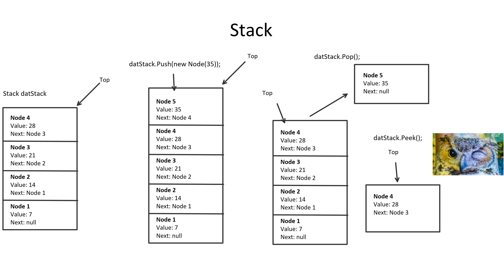
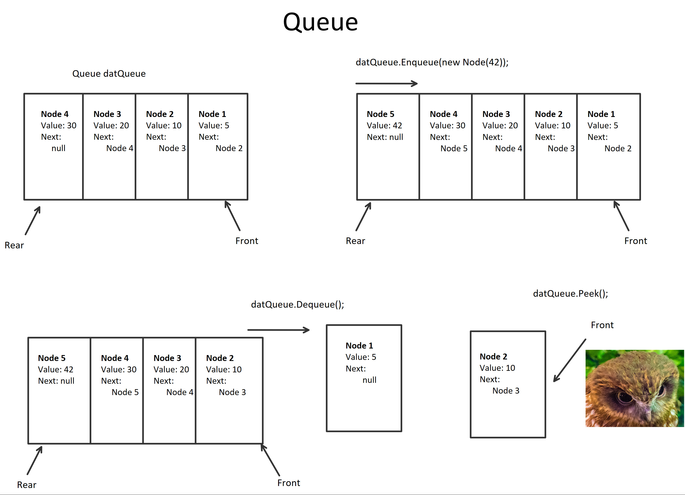

# CHALLENGE: Implement a Stack and a Queue 
This program demonstrates the functionalities of stacks and queues.

## Data Structure:	
Stacks and queues are both groups of node objects linked to each other. Unlike a linked list, they
have more direct uses such as call stacks and email queues.

Stacks have a top node, which is the last node placed onto the stack. The top
has its own value as well as a reference to the node before it. Each node also has a reference to the one
before it although this is considered as a reference to the next node in the stack (so confusing). Stacks
adopt a concept known as LIFO (last in first out). This can also be thought of as FILO (first in last out).

Queues have a front node and a rear node. They can be traversed by starting from the front and going to the
rear. In contrast to stacks, queues adopt the concept of FIFO (first in first out) or LILO (last in last out).
Each node also its own value, but a reference to the actual node behind it (as opposed to the stack's confusing "next").

## Directions
Implement a Stack and a Queue. Your Stack should meet the following criteria:

    O(1) - .Push(Node node) - Add a node to the stack
    O(1) - .Pop() - removes and return the top node of the stack
    O(1) - .Peek() - returns the top node of the stack.

Your Queue should meet the following criteria:

    O(1) - .Enqueue(Node node) - Add a node to the queue
    O(1) - .Dequeue() - removes and return the front node of the queue
    O(1) - .Peek() - returns the front node of the queue.

## Implementation
Each node is created as an object of both the stack and queue classes containing a node class object 
with an integer value and a reference to the next node (also an object of node class).

## Visual

## Stack and Queue Uses
- As said before, stacks and queues are used in email queues and call stacks. More broadly, stacks and
queues are useful when you want your data to be managed in a specific way. 
- Queues can even be seen in more concrete real life situations where people "fall in line" to do something. Stacks are noticeable when piling up
dirty dishes.
- The advantage of a stack is that the traversal is quick when grabbing the last item placed on the stack (O(1)).
With queues, it's possible to grab both the first and last items quickly because of the reference to the first and the last. However, peeking only
occurs with the first node as opposed to stacks which returns the top (or last node placed on the stack).

