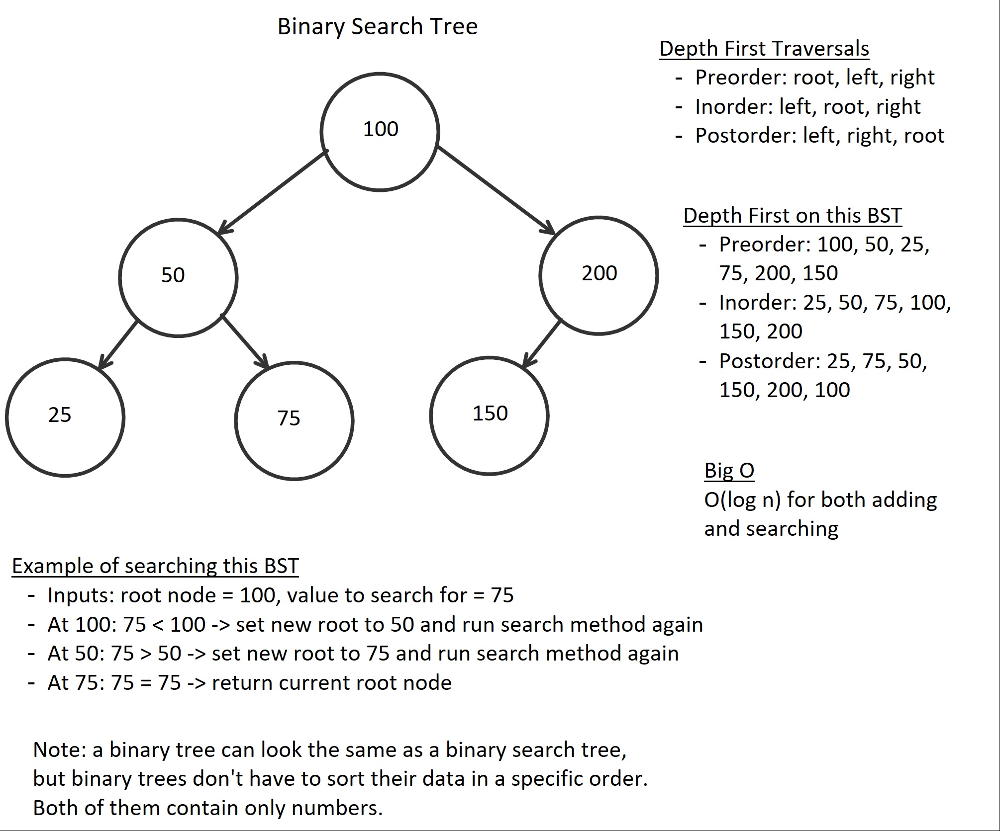
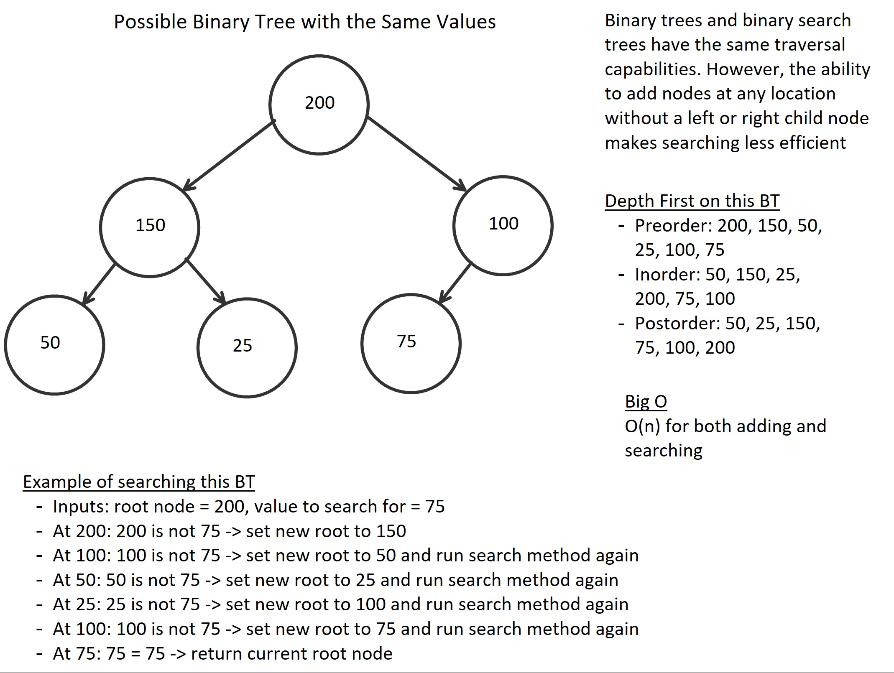

# IMPLEMENT: Binary Tree & Binary Search Tree 
This program demonstrates the implementations of a binary tree and
a binary search tree.

## Data Structure:	
Binary trees and binary search trees are groups of objects linked to each other. 
Both of them have a root node, and each root can have a left or right child that can
also have their own children. Both of them also contain numbers.

Binary trees allow new nodes to be added after any node that does not contain and left
or right child. Binary search trees, on the other hand, require nodes to be sorted with
lower values to the left and higher values to the right.

## Directions
Implement your own Binary Tree and Binary Search Tree that achieve the following traversals:

    PreOrder()
    InOrder()
    PostOrder()
    BreadthFirst()

Also allow your BinaryTree to:

    Search()

In addition, Include the following functionality on a Binary Search Tree:

    Search()
    Add a Node()

## Visual

## Binary Tree and Binary Search Tree Uses
- Binary trees are a more general category of trees, and binary search tree is one subcategory. Other
applications include binary tries for routers and hash trees for p2p programs.
- Binary search trees can be implemented in sorting algorithms. As seen through 
its search traversal, new data must be added in a specific location relative to the existing data.

